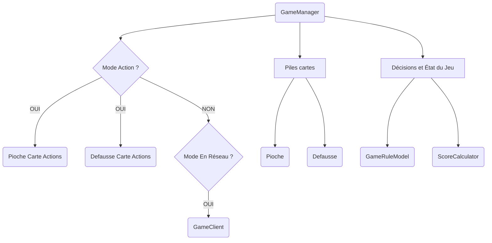
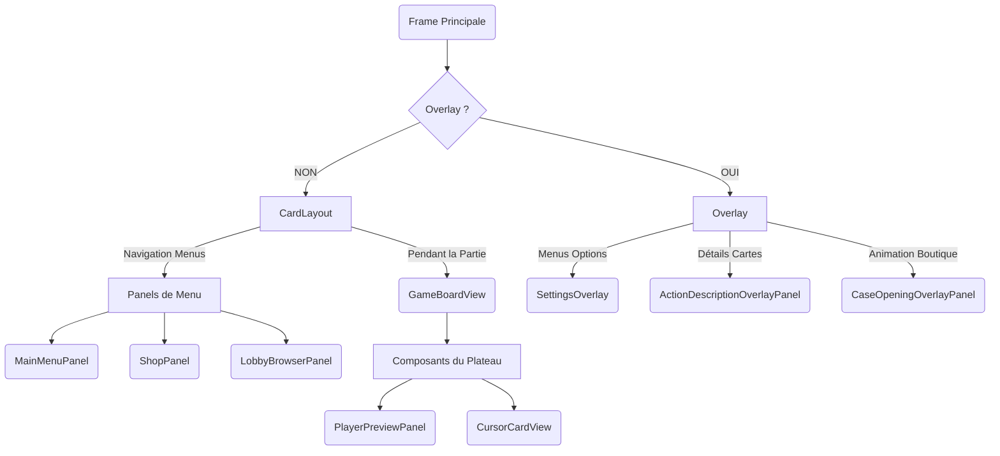

```mermaid
flowchart TB
    A(GameManager) --> B{Mode Action ?}
    B --> |OUI| C(Pioche Carte Actions)
    B --> |OUI| D(Defausse Carte Actions)
    B --> |NON| E{Mode En Réseau ?}
    A --> Z[Piles cartes]
    Z --> F(Pioche)
    Z --> G(Defausse)
    E --> |OUI| H(GameClient)
    A --> I[Décisions et État du Jeu]
    I --> J(GameRuleModel)
    I --> K(ScoreCalculator)
```

```mermaid
flowchart TB
    A(Frame Principale) --> B{Overlay ?}
    B --> |NON| Z[CardLayout]
    Z --> |Navigation Menus| C[Panels de Menu]
    C --> D(MainMenuPanel)
    C --> E(ShopPanel)
    C --> F(LobbyBrowserPanel)
    Z --> |Pendant la Partie| G(GameBoardView)
    G --> H[Composants du Plateau]
    H --> I(PlayerPreviewPanel)
    H --> J(CursorCardView)
    B --> |OUI| K[Overlay]
    K --> |Menus Options| L(SettingsOverlay)
    K --> |Détails Cartes| M(ActionDescriptionOverlayPanel)
    K --> |Animation Boutique| N(CaseOpeningOverlayPanel)
```