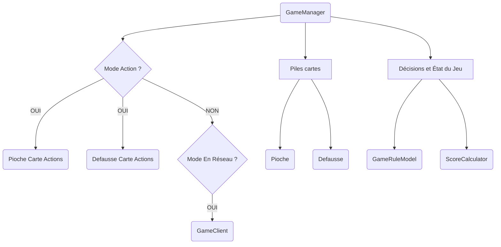
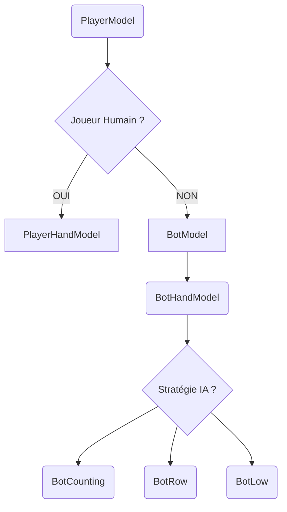
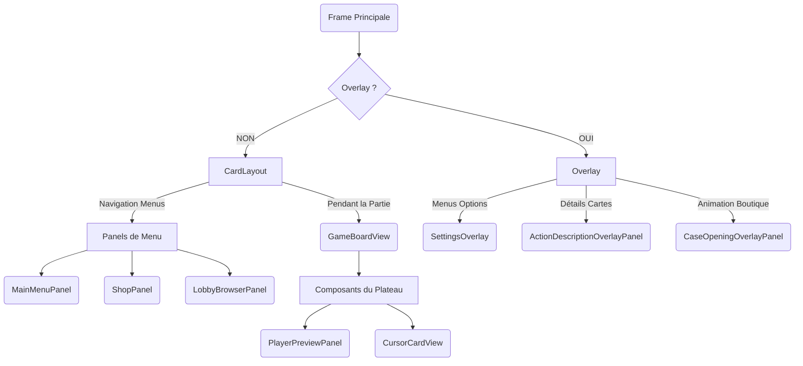
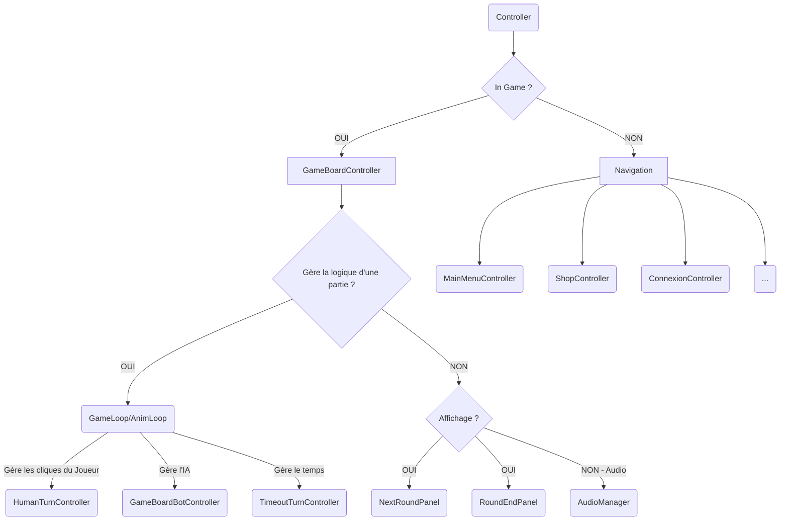
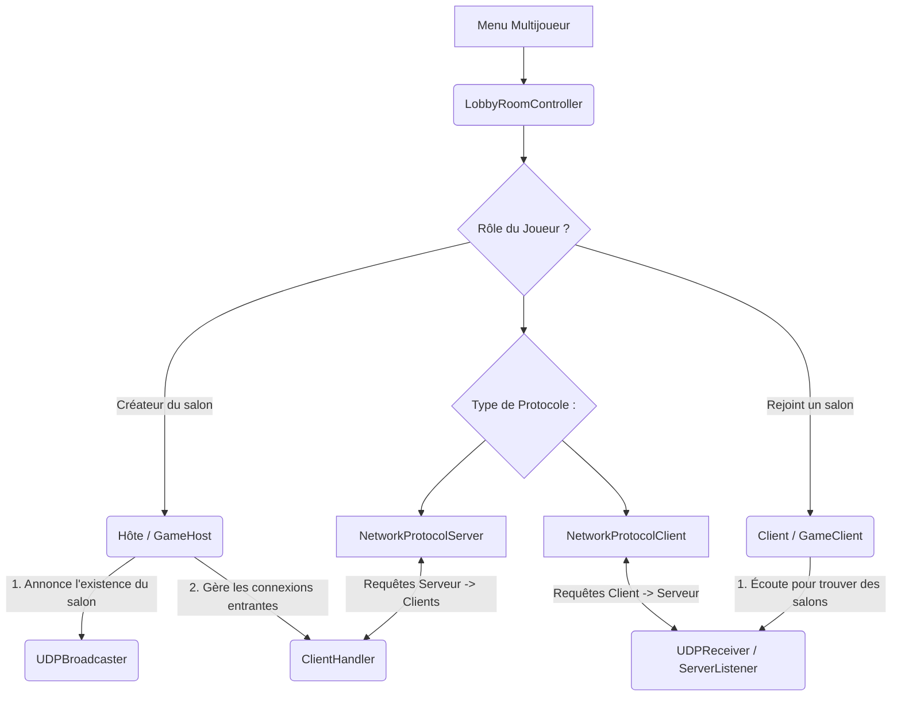
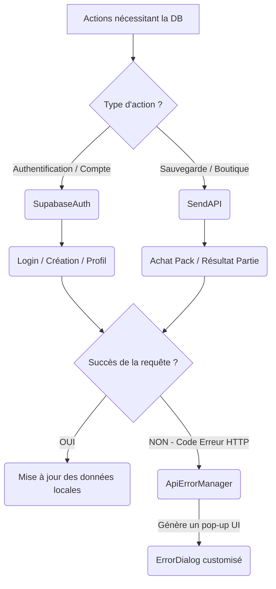

# Architecture du Projet Skyjo

---

## MODEL

```mermaid
flowchart TB
    A(GameManager) --> B{Mode Action ?}
    B --> |OUI| C(Pioche Carte Actions)
    B --> |OUI| D(Defausse Carte Actions)
    B --> |NON| E{Mode En Réseau ?}
    A --> Z[Piles cartes]
    Z --> F(Pioche)
    Z --> G(Defausse)
    E --> |OUI| H(GameClient)
    A --> I[Décisions et État du Jeu]
    I --> J(GameRuleModel)
    I --> K(ScoreCalculator)
```

---

### HUMAIN ET BOT

```mermaid
flowchart TB
    A(PlayerModel) --> B{ Joueur Humain ?}
    B --> |OUI| C[PlayerHandModel]
    B --> |NON| D[BotModel]
    D --> E(BotHandModel)
    E --> F{Stratégie IA ?}

    F --> G(BotCounting)
    F --> H(BotRow)
    F --> I(BotLow)
```
---

## VIEW 

```mermaid
flowchart TB
    A(Frame Principale) --> B{Overlay ?}
    B --> |NON| Z[CardLayout]
    Z --> |Navigation Menus| C[Panels de Menu]
    C --> D(MainMenuPanel)
    C --> E(ShopPanel)
    C --> F(LobbyBrowserPanel)
    Z --> |Pendant la Partie| G(GameBoardView)
    G --> H[Composants du Plateau]
    H --> I(PlayerPreviewPanel)
    H --> J(CursorCardView)
    B --> |OUI| K[Overlay]
    K --> |Menus Options| L(SettingsOverlay)
    K --> |Détails Cartes| M(ActionDescriptionOverlayPanel)
    K --> |Animation Boutique| N(CaseOpeningOverlayPanel)
```

---

## CONTROLLER

```mermaid
flowchart TB
    A(Controller) --> B{In Game ?}
    B --> |OUI| C[GameBoardController]
    C --> H{Gère la logique d'une partie ?}
  
    H --> |OUI|I(GameLoop/AnimLoop)
    I --> |Gère les cliques du Joueur| N(HumanTurnController)
    I --> |Gère l'IA| O(GameBoardBotController)
    I --> |Gère le temps| P(TimeoutTurnController)

    H --> |NON|J{Affichage ?}
    J --> |OUI| K(NextRoundPanel)
    J --> |OUI| L(RoundEndPanel)
    J --> |NON - Audio| M(AudioManager)

    B --> |NON| D[Navigation] 
    D --> E(MainMenuController)
    D --> F(ShopController)
    D --> Z(ConnexionController)
    D --> G(...)
```

---

### MODE EN LIGNE

```mermaid
flowchart TB
    A[Menu Multijoueur] --> B(LobbyRoomController)
    B --> C{Rôle du Joueur ?}
    C --> |Créateur du salon| D(Hôte / GameHost)
    C --> Z{Type de Protocole :}
    Z --> X[NetworkProtocolServer]
    Z --> Y[NetworkProtocolClient]
    C --> |Rejoint un salon| E(Client / GameClient)
    D --> |1. Annonce l'existence du salon| F(UDPBroadcaster)
    E --> |1. Écoute pour trouver des salons| G(UDPReceiver / ServerListener)
    D --> |2. Gère les connexions entrantes| H(ClientHandler)
    X <--> |Requêtes Serveur -> Clients| H
    Y <--> |Requêtes Client -> Serveur|G
```
---

### API ET DATABASE

```mermaid
flowchart TB
    A[Actions nécessitant la DB] --> B{Type d'action ?}
    B --> |Authentification / Compte| C(SupabaseAuth)
    B --> |Sauvegarde / Boutique| D(SendAPI)
    C --> E(Login / Création / Profil)
    D --> F(Achat Pack / Résultat Partie)
    E --> G{Succès de la requête ?}
    F --> G
    G --> |OUI| H(Mise à jour des données locales)
    G --> |NON - Code Erreur HTTP| I(ApiErrorManager)
    I --> |Génère un pop-up UI| J(ErrorDialog customisé)
```
